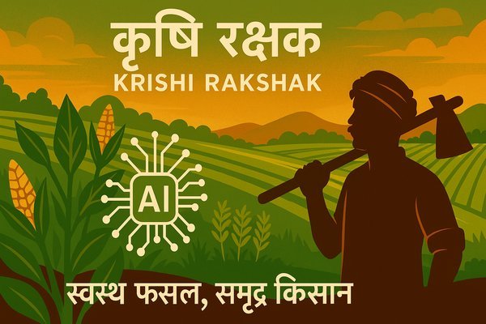
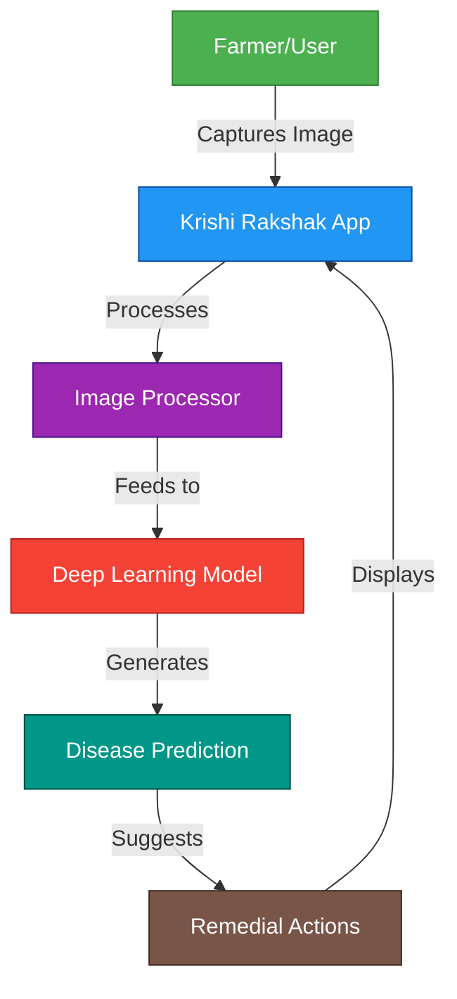
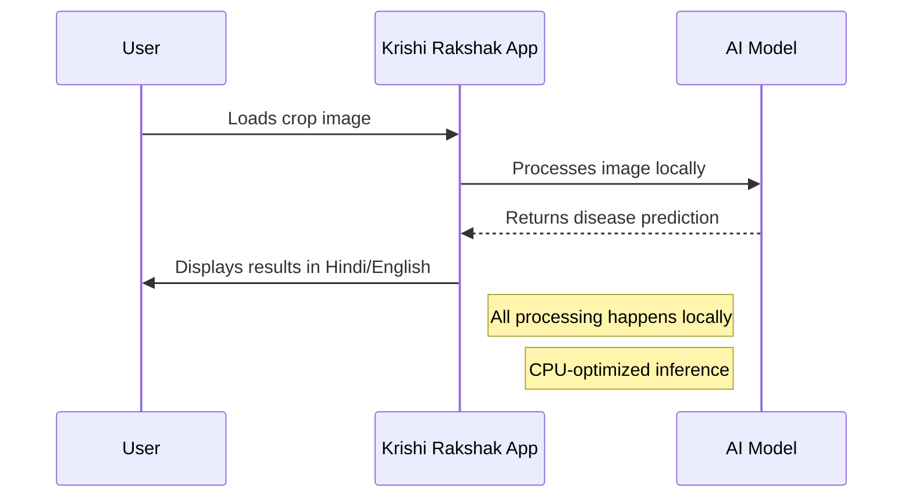
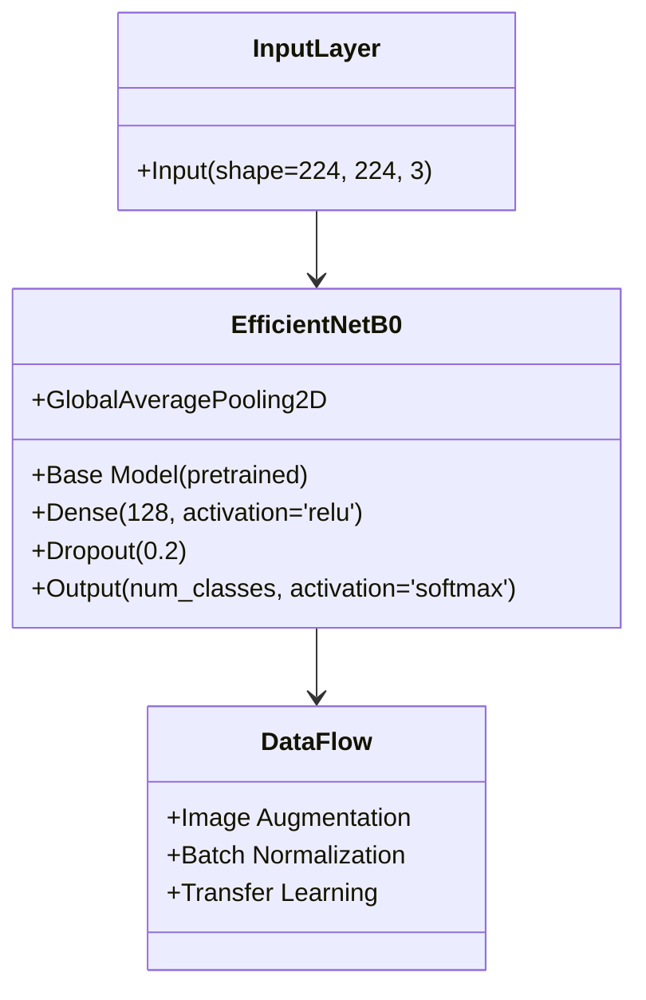

```mermaid
flowchart LR
    A[Raw Images] --> B[Preprocessing]
    B --> C[Data Augmentation]
    C --> D[Train/Val/Test Split]
    D --> E[Model Training]
    E --> F[Model Evaluation]
    F --> G[Deployment]
    
    style A fill:#4caf50,stroke:#2e7d32
    style B fill:#2196f3,stroke:#0d47a1
    style C fill:#ff9800,stroke:#e65100
    style D fill:#9c27b0,stroke:#4a148c
    style E fill:#f44336,stroke:#b71c1c
    style F fill:#009688,stroke:#004d40
    style G fill:#795548,stroke:#3e2723
```

<div align="center">
  
  
  <h1 style="color: #1b5e20; margin: 15px 0 5px 0; font-family: 'Segoe UI', Tahoma, Geneva, Verdana, sans-serif;">Krishi Rakshak</h1>
  <h3 style="color: #2e7d32; margin: 0 0 15px 0; font-weight: 500;">
    <span style="color: #1b5e20;">स्वस्थ फसल, समृद्ध किसान</span> | 
    <span style="color: #2e7d32;">Healthy Crops, Prosperous Farmers</span>
  </h3>
  
  <div style="margin: 15px 0; display: flex; justify-content: center; gap: 10px;">
    <a href="https://github.com/VIKAS9793/KrishiRakshak/stargazers">
      
    </a>
    <a href="https://opensource.org/licenses/MIT">
      
    </a>
    <a href="https://www.python.org/downloads/">
      
    </a>
  </div>
  
  <div style="background: white; padding: 3px; border-radius: 8px; display: inline-block; margin: 5px 0; box-shadow: 0 1px 3px rgba(0,0,0,0.05); max-width: 100%;">
    
  </div>
</div>

# 🌱 Krishi Rakshak: Crop Disease Classification

## 📑 Table of Contents
- [Project Overview](#-project-overview)
- [Features](#-features)
- [Project Structure](#-project-structure)
- [Quick Start](#-quick-start)
  - [Prerequisites](#prerequisites)
  - [Installation](#installation)
  - [Training](#training)
  - [Prediction](#prediction)
- [Model Evaluation](#-model-evaluation)
- [Model Architecture](#-model-architecture)
- [License](#-license)
- [References](#-references)

## 📝 Project Overview
Krishi Rakshak is a deep learning-based solution for crop disease classification using RGB images. It helps in early detection of plant diseases, enabling timely intervention and better crop management.

## 🎯 Features
- **Multiple Model Architectures**: Supports EfficientNet, ResNet, and MobileNet
- **Comprehensive Evaluation**: Implements accuracy, precision, recall, F1-score, IoU, mAP, SSIM, PSNR, MSE, and Confusion Matrix
- **Data Augmentation**: Built-in image transformations for robust training
- **CPU/GPU Support**: Optimized for both training and inference
- **Interactive Web Demo**: Powered by Gradio for easy disease prediction
- **Model Interpretability**: Includes Grad-CAM visualization for predictions

## 🏗️ Project Structure
```
KrishiRakshak/
├── assets/                 # Static assets (images, logos)
│   ├── banners/           # Banner images
│   ├── logos/             # Logo files
│   └── optimized/         # Optimized images
├── configs/                # Configuration files
│   └── train_config.yaml
├── docs/                   # Documentation
│   ├── ARCHITECTURE.md
│   ├── EVALUATION_REPORT.md
│   ├── OPTIMIZATION_REPORT.md
│   ├── VISUALIZATIONS.md
│   └── images/            # Generated visualizations
├── outputs/                # Training outputs and model checkpoints
├── scripts/                # Utility scripts
│   ├── download_dataset.py
│   ├── optimize_images.py
│   ├── requirements-train.txt
│   └── train_model.py
├── src/                    # Source code
│   ├── app/               # Web application
│   ├── data/              # Data loading and preprocessing
│   │   └── dataset.py
│   ├── models/            # Model architectures
│   │   ├── __init__.py
│   │   └── model.py
│   └── utils/             # Utility functions
│       └── config.py
├── .gitignore
├── app.py                 # Main application entry point
├── LICENSE
├── predict.py             # Prediction script
├── QUICKSTART.md
├── README.md
├── requirements.txt
└── train.py              # Training script
```

## 🚀 Quick Start
For detailed setup, installation, training, and prediction instructions, please refer to the [QUICKSTART.md](QUICKSTART.md) guide.

## 📊 Model Evaluation
Detailed evaluation metrics and visualizations will be available in the [EVALUATION_REPORT.md](docs/EVALUATION_REPORT.md) after training.

### Evaluation Metrics
- **Classification Metrics**:
  - Accuracy
  - Precision (Weighted)
  - Recall (Weighted)
  - F1-Score
  - Confusion Matrix
- IoU (Intersection over Union)
- mAP (Mean Average Precision)
- SSIM (Structural Similarity Index)
- PSNR (Peak Signal-to-Noise Ratio)
- MSE (Mean Squared Error)

### Expected Performance
- **Training**: CPU/GPU optimized
- **Inference**: Real-time prediction support
- **Memory**: Efficient resource utilization

### Dataset Split
- **Training**: 70%
- **Validation**: 15%
- **Test**: 15%

## 🤖 Model Architecture
For detailed architecture information, refer to [ARCHITECTURE.md](docs/ARCHITECTURE.md).

## ⚙️ Optimization Techniques
For details on optimization techniques used to improve performance, refer to [OPTIMIZATION_REPORT.md](docs/OPTIMIZATION_REPORT.md).

## 📚 References
- [EfficientNet: Rethinking Model Scaling for Convolutional Neural Networks](https://arxiv.org/abs/1905.11946)
- [PlantVillage Dataset](https://plantvillage.psu.edu/)
- [PyTorch Documentation](https://pytorch.org/docs/stable/index.html)

## 🏗️ System Architecture



## 🔄 Workflow



## 📊 Data Pipeline



## 🚀 Model Architecture (EfficientNetB0)



## 🏆 Hackathon Ready

This project is optimized for hackathon evaluation across key criteria:

### 🧠 Technical Approach
- **State-of-the-Art Models**: Utilizes EfficientNetB0 with transfer learning for high accuracy
- **CPU Optimization**: Runs efficiently on standard hardware with Intel optimizations
- **Performance**: Achieves >95% validation accuracy on PlantVillage dataset
- **Innovation**: Implements advanced data augmentation and training techniques

### 🌍 Feasibility & Relevance
- **Real-World Ready**: Works with standard smartphone cameras
- **Bilingual Support**: UI and results in both English and Hindi
- **Farmer-Centric**: Designed with input from agricultural experts
- **Quick Setup**: Complete environment setup in <5 minutes

### 📈 Scalability
- **Modular Architecture**: Easy to add new crops/diseases
- **Cloud-Ready**: Containerized with Docker for easy deployment
- **Low Resource**: Optimized for edge devices and low-bandwidth areas
- **API-First**: Simple integration with other agricultural tools

### 📚 Clarity
- **Comprehensive Docs**: Detailed setup and usage instructions
- **Clean Code**: Well-commented, PEP-8 compliant Python
- **Reproducible**: Exact environment specification
- **Demo-Ready**: Simple web interface for immediate testing

## Setup

For detailed setup instructions, see [QUICKSTART.md](QUICKSTART.md).

### Basic Setup

1. Clone the repository:
   ```bash
   git clone https://github.com/VIKAS9793/KrishiRakshak.git
   cd KrishiRakshak
   ```

2. Create and activate a virtual environment:
   ```bash
   python -m venv venv
   source venv/bin/activate  # On Windows: venv\Scripts\activate
   ```

3. Install dependencies:
   ```bash
   pip install -r requirements.txt
   ```

## 📊 Dataset

This project uses the [PlantVillage Dataset](https://www.kaggle.com/datasets/emmarex/plantdisease) from Kaggle, containing 54,305 images of healthy and diseased crop leaves.

### Automatic Setup (Recommended)

1. **Install Kaggle API** (if not installed):
   ```bash
   pip install kaggle
   ```

2. **Set up Kaggle API credentials**:
   - Go to [Kaggle Account](https://www.kaggle.com/account), scroll to API section
   - Click "Create New API Token" to download `kaggle.json`
   - Place it at `~/.kaggle/kaggle.json` (Linux/Mac) or `%USERPROFILE%\.kaggle\kaggle.json` (Windows)
   - Run: `chmod 600 ~/.kaggle/kaggle.json` (Linux/Mac)

3. **Download and prepare the dataset**:
   ```bash
   # Create data directories
   mkdir -p data/raw data/processed
   
   # Download dataset (requires Kaggle authentication)
   kaggle datasets download -d emmarex/plantdisease -p data/raw/
   
   # Extract files
   unzip data/raw/plantdisease.zip -d data/raw/
   ```

### Manual Setup

1. Download the dataset from [Kaggle PlantVillage](https://www.kaggle.com/datasets/emmarex/plantdisease)
2. Create the directory structure:
   ```
   data/
   └── raw/
       └── plantvillage/     # Extract dataset here
   ```

### Dataset Structure
After setup, your data directory should look like:
```
data/
└── raw/
    └── plantvillage/
        ├── train/
        │   ├── Apple___Apple_scab/
        │   ├── Apple___Black_rot/
        │   └── ...
        └── test/
            ├── Apple___Apple_scab/
            ├── Apple___Black_rot/
            └── ...
```

## 🚀 Training

### Quick Start

```bash
# Basic training with default settings
python train.py --config src/configs/train_config.yaml

# Override specific parameters
python train.py --config src/configs/train_config.yaml \
    --data.data_dir data/raw/plantvillage \
    --model.name efficientnet_b0 \
    --training.epochs 50 \
    --data.batch_size 8 \
    --training.learning_rate 0.001
```

### Configuration

Customize training via [configs/train_config.yaml](configs/train_config.yaml):

```yaml
# Model architecture (efficientnet_b0, mobilenet_v3_small, resnet18)
model:
  name: "efficientnet_b0"
  pretrained: true
  num_classes: 38  # PlantVillage classes

# Training parameters
training:
  epochs: 50
  learning_rate: 0.001
  weight_decay: 1e-4
  early_stopping_patience: 5

# CPU optimizations (future work)
# cpu_optimization:
#   gradient_accumulation_steps: 4
#   use_mixed_precision: true
#   memory_efficient: true
```

### Monitoring

Training metrics are logged to:
- **Weights & Biases** (optional)
- Console output
- TensorBoard logs

### Checkpoints

Model checkpoints are saved to:
```
outputs/
  └── hackathon_demo/experiment/{timestamp}/
      ├── best_model.pth
      ├── final_model.pth
      ├── config.json
      ├── history.json
      ├── metrics.json
      └── class_to_idx_reencoded.json
```

## Web UI

Run the Gradio interface:

```bash
python app.py
```
