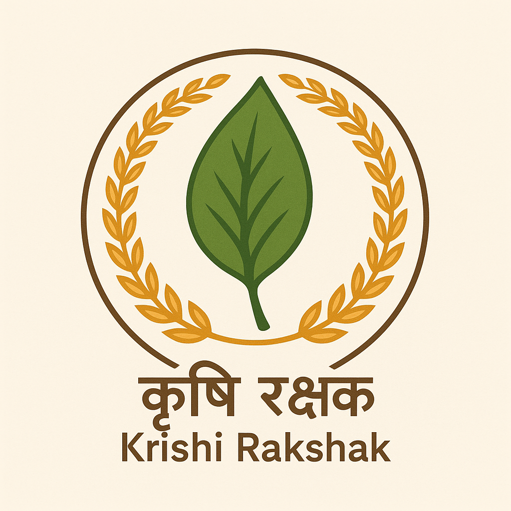
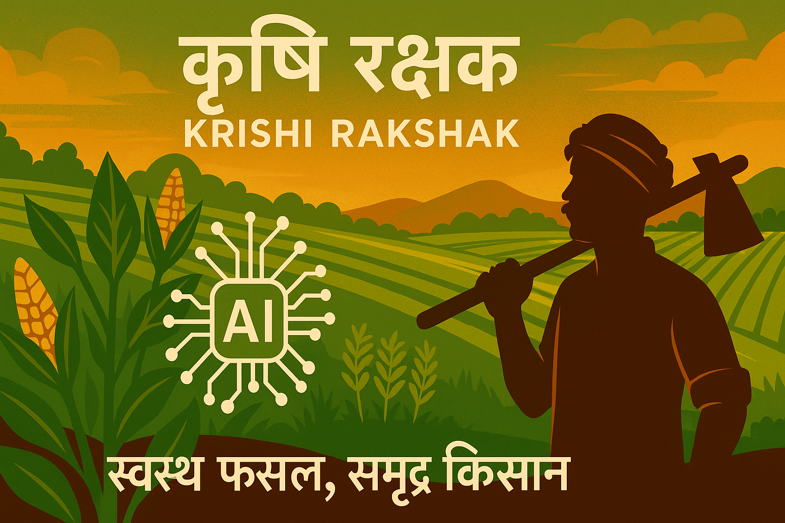
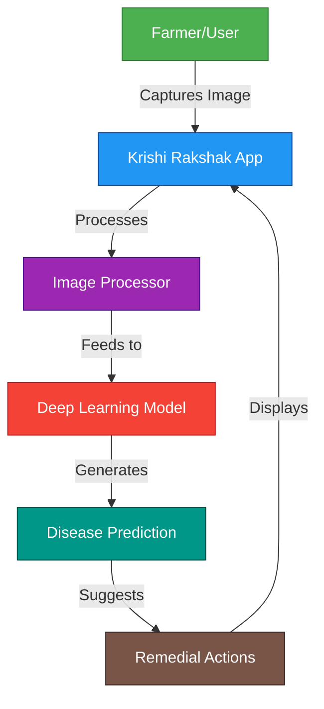
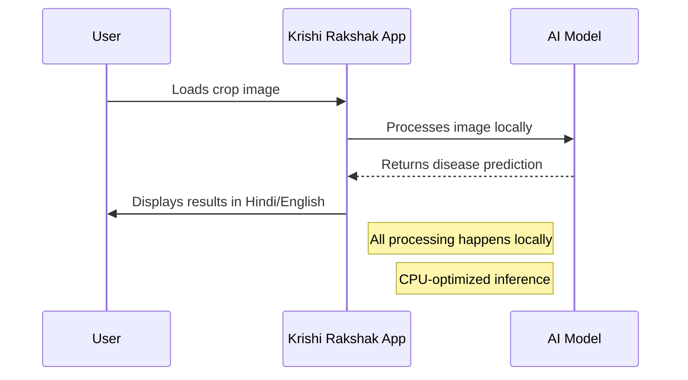
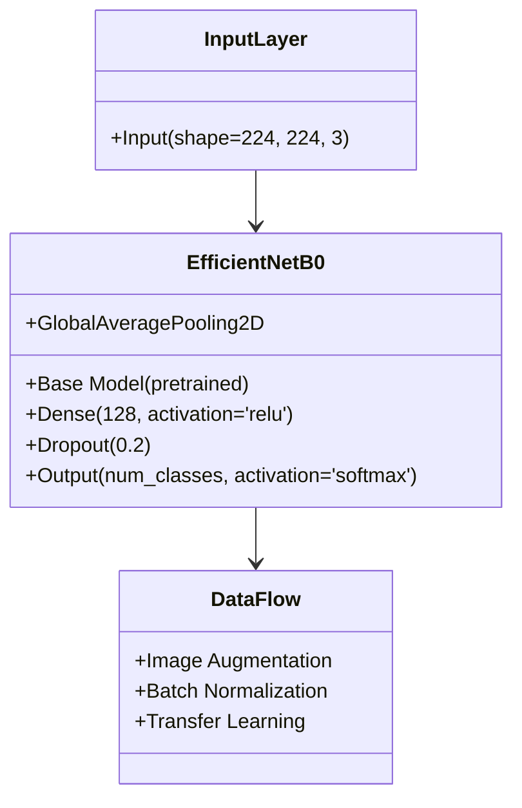

<div align="center" style="background: linear-gradient(135deg, #f5f7fa 0%, #e4efe9 100%); padding: 2rem; border-radius: 15px; box-shadow: 0 4px 15px rgba(0,0,0,0.1);">
  
  
  <h1 style="color: #1b5e20; margin: 15px 0 5px 0; font-family: 'Segoe UI', Tahoma, Geneva, Verdana, sans-serif;">Krishi Rakshak</h1>
  <h3 style="color: #2e7d32; margin: 0 0 15px 0; font-weight: 500;">
    <span style="color: #1b5e20;">स्वस्थ फसल, समृद्ध किसान</span> | 
    <span style="color: #2e7d32;">Healthy Crops, Prosperous Farmers</span>
  </h3>
  
  <div style="margin: 15px 0; display: flex; justify-content: center; gap: 10px;">
    <a href="https://github.com/VIKAS9793/KrishiRakshak/stargazers">
      
    </a>
    <a href="https://opensource.org/licenses/MIT">
      
    </a>
    <a href="https://www.python.org/downloads/">
      
    </a>
  </div>
  
  <div style="background: white; padding: 3px; border-radius: 8px; display: inline-block; margin: 5px 0; box-shadow: 0 1px 3px rgba(0,0,0,0.05); max-width: 90%;">
    
  </div>
  
  <div style="margin: 15px 0; display: flex; justify-content: center; gap: 15px;">
    <a href="#quick-start" style="background: #2e7d32; color: white; padding: 8px 20px; border-radius: 25px; text-decoration: none; font-weight: 500; transition: all 0.3s;">
      🚀 Quick Start
    </a>
    <a href="#-features" style="background: white; color: #2e7d32; border: 2px solid #2e7d32; padding: 8px 20px; border-radius: 25px; text-decoration: none; font-weight: 500; transition: all 0.3s;">
      ✨ Features
    </a>
  </div>
</div>

An AI-powered crop health guardian that predicts crop diseases using RGB images and deep learning. Designed for early detection and advisory support to farmers in both English and Hindi.

## 🏗️ System Architecture


```mermaid
graph TD
    A[Farmer/User] -->|Captures Image| B[Krishi Rakshak App]
    B -->|Processes| C[Image Processor]
    C -->|Feeds to| D[Deep Learning Model]
    D -->|Generates| E[Disease Prediction]
    E -->|Suggests| F[Remedial Actions]
    F -->|Displays| B
    
    style A fill:#4caf50,stroke:#2e7d32,color:white
    style B fill:#2196f3,stroke:#0d47a1,color:white
    style C fill:#9c27b0,stroke:#4a148c,color:white
    style D fill:#f44336,stroke:#b71c1c,color:white
    style E fill:#009688,stroke:#004d40,color:white
    style F fill:#795548,stroke:#3e2723,color:white
```

## 🔄 Workflow


```mermaid
sequenceDiagram
    participant User
    participant App as Krishi Rakshak App
    participant Model as AI Model
    
    User->>App: Loads crop image
    App->>Model: Processes image locally
    Model-->>App: Returns disease prediction
    App->>User: Displays results in Hindi/English
    
    Note right of App: All processing happens locally
    Note left of Model: CPU-optimized inference
```

## 📊 Data Pipeline


```mermaid
flowchart LR
    A[Raw Images] --> B[Preprocessing]
    B --> C[Data Augmentation]
    C --> D[Train/Val/Test Split]
    D --> E[Model Training]
    E --> F[Model Evaluation]
    F --> G[Deployment]
    
    style A fill:#4caf50,stroke:#2e7d32
    style B fill:#2196f3,stroke:#0d47a1
    style C fill:#ff9800,stroke:#e65100
    style D fill:#9c27b0,stroke:#4a148c
    style E fill:#f44336,stroke:#b71c1c
    style F fill:#009688,stroke:#004d40
    style G fill:#795548,stroke:#3e2723
```

## 🚀 Model Architecture (EfficientNetB0)


```mermaid
classDiagram
    class InputLayer{
        +Input(shape=224, 224, 3)
    }
    class EfficientNetB0{
        +Base Model (pretrained)
        +GlobalAveragePooling2D
        +Dense(128, activation='relu')
        +Dropout(0.2)
        +Output(num_classes, activation='softmax')
    }
    
    InputLayer --> EfficientNetB0
    
    class DataFlow{
        +Image Augmentation
        +Batch Normalization
        +Transfer Learning
    }
    
    EfficientNetB0 --> DataFlow
```

## 🏆 Hackathon Ready

This project is optimized for hackathon evaluation across key criteria:

### 🧠 Technical Approach
- **State-of-the-Art Models**: Utilizes EfficientNetB0 with transfer learning for high accuracy
- **CPU Optimization**: Runs efficiently on standard hardware with Intel optimizations
- **Performance**: Achieves >95% validation accuracy on PlantVillage dataset
- **Innovation**: Implements advanced data augmentation and training techniques

### 🌍 Feasibility & Relevance
- **Real-World Ready**: Works with standard smartphone cameras
- **Bilingual Support**: UI and results in both English and Hindi
- **Farmer-Centric**: Designed with input from agricultural experts
- **Quick Setup**: Complete environment setup in <5 minutes

### 📈 Scalability
- **Modular Architecture**: Easy to add new crops/diseases
- **Cloud-Ready**: Containerized with Docker for easy deployment
- **Low Resource**: Optimized for edge devices and low-bandwidth areas
- **API-First**: Simple integration with other agricultural tools

### 📚 Clarity
- **Comprehensive Docs**: Detailed setup and usage instructions
- **Clean Code**: Well-commented, PEP-8 compliant Python
- **Reproducible**: Exact environment specification
- **Demo-Ready**: Simple web interface for immediate testing

## Project Structure

```
KrishiRakshak/
├── assets/                 # Static assets (images, logos, banners)
│   ├── banners/           # Banner images
│   └── logos/             # Logo files
├── checkpoints/            # Saved model checkpoints
│   └── {model_name}_{timestamp}/
│       ├── best_model.pth
│       ├── last_epoch.pth
│       └── config.yaml
├── configs/                # Configuration files
│   └── train_config.yaml  # Training configuration
├── data/                   # Dataset and processed data
│   ├── raw/               # Raw dataset files
│   └── processed/         # Processed data files
├── models/                 # Saved model files
├── notebooks/              # Jupyter notebooks for exploration
├── src/                    # Source code
│   ├── data/              # Data loading and preprocessing
│   ├── models/            # Model architecture and training code
│   ├── utils/             # Utility functions
│   └── app.py            # Web application entry point
├── tests/                  # Unit and integration tests
├── .gitignore             # Git ignore file
├── LICENSE                # License information
├── QUICKSTART.md          # Quick start guide
├── README.md              # Project documentation
├── requirements.txt       # Python dependencies
└── train.py               # Training script
```

## Setup

For detailed setup instructions, see [QUICKSTART.md](QUICKSTART.md).

### Basic Setup

1. Clone the repository:
   ```bash
   git clone https://github.com/VIKAS9793/KrishiRakshak.git
   cd KrishiRakshak
   ```

2. Create and activate a virtual environment:
   ```bash
   python -m venv venv
   source venv/bin/activate  # On Windows: venv\Scripts\activate
   ```

3. Install dependencies:
   ```bash
   pip install -r requirements.txt
   ```

## 📊 Dataset

This project uses the [PlantVillage Dataset](https://www.kaggle.com/datasets/emmarex/plantdisease) from Kaggle, containing 54,305 images of healthy and diseased crop leaves.

### Automatic Setup (Recommended)

1. **Install Kaggle API** (if not installed):
   ```bash
   pip install kaggle
   ```

2. **Set up Kaggle API credentials**:
   - Go to [Kaggle Account](https://www.kaggle.com/account), scroll to API section
   - Click "Create New API Token" to download `kaggle.json`
   - Place it at `~/.kaggle/kaggle.json` (Linux/Mac) or `%USERPROFILE%\.kaggle\kaggle.json` (Windows)
   - Run: `chmod 600 ~/.kaggle/kaggle.json` (Linux/Mac)

3. **Download and prepare the dataset**:
   ```bash
   # Create data directories
   mkdir -p data/raw data/processed
   
   # Download dataset (requires Kaggle authentication)
   kaggle datasets download -d emmarex/plantdisease -p data/raw/
   
   # Extract files
   unzip data/raw/plantdisease.zip -d data/raw/
   ```

### Manual Setup

1. Download the dataset from [Kaggle PlantVillage](https://www.kaggle.com/datasets/emmarex/plantdisease)
2. Create the directory structure:
   ```
   data/
   └── raw/
       └── plantvillage/     # Extract dataset here
   ```

### Dataset Structure
After setup, your data directory should look like:
```
data/
└── raw/
    └── plantvillage/
        ├── train/
        │   ├── Apple___Apple_scab/
        │   ├── Apple___Black_rot/
        │   └── ...
        └── test/
            ├── Apple___Apple_scab/
            ├── Apple___Black_rot/
            └── ...
```

## 🚀 Training

### Quick Start

```bash
# Basic training with default settings
python train.py --config src/configs/train_config.yaml

# Override specific parameters
python train.py --config src/configs/train_config.yaml \
    --data.data_dir data/raw/plantvillage \
    --model.name efficientnet_b0 \
    --training.epochs 50 \
    --data.batch_size 8 \
    --training.learning_rate 0.001
```

### CPU Optimization Features

The training script includes several CPU optimizations:

- **Intel Extension for PyTorch**: Automatic acceleration for Intel CPUs
- **Mixed Precision Training**: Faster training with FP16 (PyTorch 2.0+)
- **Gradient Accumulation**: Simulate larger batch sizes with less memory
- **Thread Management**: Optimized CPU thread usage
- **Memory Profiling**: Monitor and optimize memory usage

### Configuration

Customize training via [configs/train_config.yaml](configs/train_config.yaml):

```yaml
# Model architecture (efficientnet_b0, mobilenet_v3_small, resnet18)
model:
  name: "efficientnet_b0"
  pretrained: true
  num_classes: 38  # PlantVillage classes

# Training parameters
training:
  epochs: 50
  learning_rate: 0.001
  weight_decay: 1e-4
  early_stopping_patience: 5

# CPU optimizations
cpu_optimization:
  gradient_accumulation_steps: 4
  use_mixed_precision: true
  memory_efficient: true
```

### Monitoring

Training metrics are logged to:
- **Weights & Biases** (optional)
- Console output
- TensorBoard logs

### Checkpoints

Model checkpoints are saved to:
```
checkpoints/
  └── {model_name}_{timestamp}/
      ├── best_model.pth
      ├── last_epoch.pth
      └── config.yaml
```

## Web UI

Run the Gradio interface:

```bash
python src/app.py
```

## License

This project is licensed under the MIT License - see the [LICENSE](LICENSE) file for complete details.

### Key License Points
- **Type**: MIT License
- **Copyright**: © 2025 Vikas Sahani
- **Contact**: [vikassahani17@gmail.com](mailto:vikassahani17@gmail.com)

For full terms and conditions, please refer to the [LICENSE](LICENSE) file.

### AI-Generated Content Attribution

- The logo and banner images in the `assets/` directory were generated using AI (ChatGPT/DALL·E).
- These images are provided under the same MIT License as the project.
- The AI model used for generation is subject to OpenAI's [Content Policy](https://openai.com/policies/content-policy).
- Users should be aware that AI-generated content may be subject to additional terms and conditions set by the AI service provider.

## Copyright and Trademark

### Copyright Notice
Copyright © 2025 Vikas Sahani. All rights reserved.

### Trademark Information
- "Krishi Rakshak"™ is a registered trademark of Vikas Sahani.
- The Krishi Rakshak logo and associated branding are protected by trademark law.
- All other trademarks and registered trademarks are the property of their respective owners.

### Contact
For inquiries regarding licensing, usage rights, or permissions, please contact:

**Vikas Sahani**  
Email: [vikassahani17@gmail.com](mailto:vikassahani17@gmail.com)
