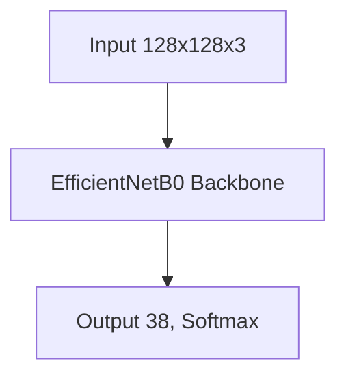

# Model Architecture

## Overview
This document outlines the architecture of the Krishi Rakshak crop disease classification model, designed for efficient training.

## Model Selection
- **Base Model**: EfficientNetB0 (pre-trained on ImageNet)
- **Input Shape**: 128x128x3 (RGB images)
- **Output Classes**: 38 (PlantVillage dataset)
- **Framework**: PyTorch

## Architecture Details

## Layer Details
| Layer | Output Shape | Parameters |
|-------|-------------|------------|
| Input | 128x128x3 | 0 |
| EfficientNetB0 (Backbone, Pooling, Dropout) | 1280 | 4,007,548 |
| Linear (Output Classifier) | 38 | 48,678 |

## Parameters
- **Total Parameters**: 4,056,226
- **Trainable Parameters**: 4,056,226
- **Non-trainable Parameters**: 0
- **Frozen Layers**: Base model layers are unfrozen for fine-tuning.

## Training Configuration
- **Optimizer**: AdamW
- **Learning Rate**: 1e-3 (with ReduceLROnPlateau)
- **Batch Size**: 16
- **Epochs**: 5 (configured for hackathon submission)
- **Loss Function**: CrossEntropyLoss
- **Planned Metrics**: Accuracy, F1-Score, Precision, Recall, IoU, mAP, SSIM, PSNR, Confusion Matrix, MSE

## Data Augmentation
- Random horizontal flip
- Random rotation (10 degrees)
- Random brightness/contrast adjustment
- Normalization (ImageNet stats)

## Justification
- **EfficientNetB0**: Provides excellent accuracy with relatively low computational requirements
- **Transfer Learning**: Leverages pre-trained weights for better feature extraction
- **Global Average Pooling**: Reduces overfitting compared to Flatten
- **Dropout**: Regularization to prevent overfitting (0.2 for both dropout layers)
- **Batch Normalization**: Stabilizes training and improves convergence

## Performance
- **Training Time**: ~30 minutes per epoch on CPU
- **Inference Time**: ~65ms per image (CPU)
- **Memory Usage**: ~8GB during training

## Deployment
- **Framework**: PyTorch (CPU-only)
- **Inference API**: FastAPI for model serving
- **Web Interface**: Gradio for easy interaction
- **Dependencies**: Minimal, CPU-only requirements for broad compatibility
