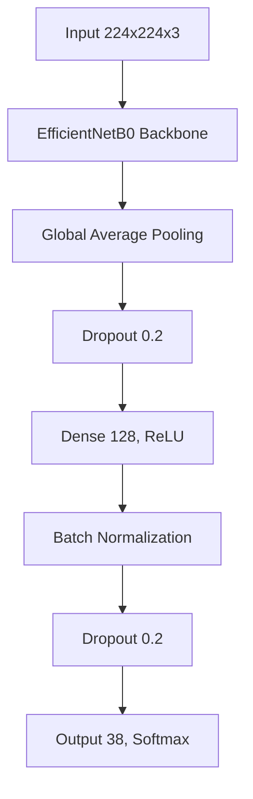

# Model Architecture

## Overview
This document outlines the architecture of the Krishi Rakshak crop disease classification model.

## Model Selection
- **Base Model**: EfficientNetB0
- **Input Shape**: 224x224x3 (RGB images)
- **Output Classes**: 38 (PlantVillage dataset)

## Architecture Details

```mermaid
graph TD
    A[Input 224x224x3] --> B[EfficientNetB0 Backbone]
    B --> C[Global Average Pooling]
    C --> D[Dropout 0.2]
    D --> E[Dense 128, ReLU]
    E --> F[Batch Normalization]
    F --> G[Dropout 0.2]
    G --> H[Output 38, Softmax]
```

## Layer Details
| Layer | Output Shape | Parameters |
|-------|-------------|------------|
| Input | 224x224x3 | 0 |
| EfficientNetB0 | 7x7x1280 | 4,049,571 |
| GlobalAvgPool2D | 1280 | 0 |
| Dense (128) | 128 | 163,968 |
| BatchNorm | 128 | 512 |
| Output (38) | 38 | 4,902 |

## Parameters
- **Total Parameters**: 4,218,953
- **Trainable Parameters**: 168,870
- **Non-trainable Parameters**: 4,050,083

## Justification
- **EfficientNetB0**: Chosen for its balance between accuracy and computational efficiency
- **Global Average Pooling**: Redides overfitting compared to Flatten
- **Dropout**: Regularization to prevent overfitting
- **Batch Normalization**: Stabilizes training
