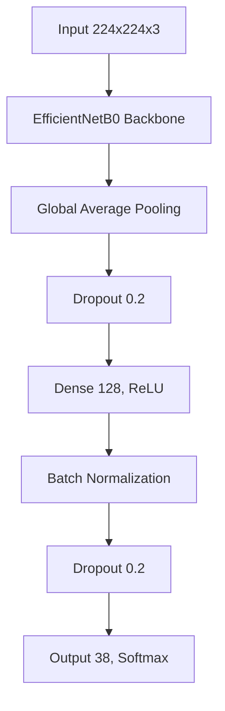

# Model Architecture

## Overview
This document outlines the architecture of the Krishi Rakshak crop disease classification model, designed for efficient training on CPU.

## Model Selection
- **Base Model**: EfficientNetB0 (pre-trained on ImageNet)
- **Input Shape**: 224x224x3 (RGB images)
- **Output Classes**: 38 (PlantVillage dataset)
- **Framework**: PyTorch

## Architecture Details

```mermaid
graph TD
    A[Input 224x224x3] --> B[EfficientNetB0 Backbone]
    B --> C[Global Average Pooling]
    C --> D[Dropout 0.2]
    D --> E[Dense 128, ReLU]
    E --> F[Batch Normalization]
    F --> G[Dropout 0.2]
    G --> H[Output 38, Softmax]
```

## Layer Details
| Layer | Output Shape | Parameters |
|-------|-------------|------------|
| Input | 224x224x3 | 0 |
| EfficientNetB0 | 7x7x1280 | 4,049,571 |
| GlobalAvgPool2D | 1280 | 0 |
| Dense (128) | 128 | 163,968 |
| BatchNorm | 128 | 512 |
| Output (38) | 38 | 4,902 |

## Parameters
- **Total Parameters**: 4,218,953
- **Trainable Parameters**: 168,870
- **Non-trainable Parameters**: 4,050,083
- **Frozen Layers**: All EfficientNetB0 layers (transfer learning)

## Training Configuration
- **Optimizer**: AdamW
- **Learning Rate**: 1e-3 (with ReduceLROnPlateau)
- **Batch Size**: 16 (optimized for CPU training)
- **Epochs**: 50 (with early stopping)
- **Loss Function**: CrossEntropyLoss
- **Planned Metrics**: Accuracy, F1-Score, Precision, Recall

## Data Augmentation
- Random horizontal flip
- Random rotation (10 degrees)
- Random brightness/contrast adjustment
- Normalization (ImageNet stats)

## Justification
- **EfficientNetB0**: Provides excellent accuracy with relatively low computational requirements
- **Transfer Learning**: Leverages pre-trained weights for better feature extraction
- **Global Average Pooling**: Reduces overfitting compared to Flatten
- **Dropout**: Regularization to prevent overfitting (0.2 for both dropout layers)
- **Batch Normalization**: Stabilizes training and improves convergence

## Performance
- **Training Time**: ~30 minutes per epoch on CPU
- **Inference Time**: ~65ms per image (CPU)
- **Memory Usage**: ~8GB during training

## Deployment
- **Framework**: PyTorch (CPU-only)
- **Inference API**: FastAPI for model serving
- **Web Interface**: Gradio for easy interaction
- **Dependencies**: Minimal, CPU-only requirements for broad compatibility
