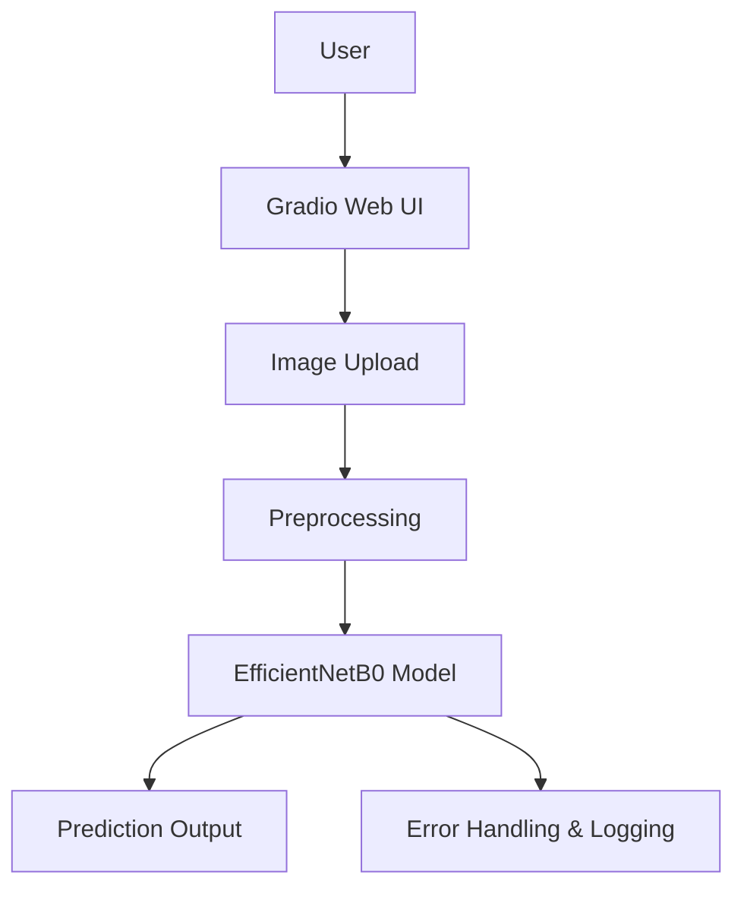

# Project Report

**Project:** KrishiRakshak – AI-Powered Crop Health Guardian  
**Date:** June 8, 2024  
**Prepared by:** Vikas Sahani

---

## 1. Introduction

KrishiRakshak is an AI-powered solution designed to assist farmers and agricultural professionals in diagnosing crop diseases and monitoring plant health using image analysis. The project leverages deep learning and a user-friendly interface to provide rapid, accurate, and accessible crop health assessments.

**Note:** While developed under hackathon constraints, KrishiRakshak is not just a prototype. It is a Minimum Viable Product (MVP) that demonstrates a real use case and achieves strong accuracy within the constraints of the trained dataset. The system is ready for practical demonstration and can be further enhanced for broader deployment.

---

## 2. Problem Statement

Crop diseases and pest infestations are major threats to agricultural productivity, especially in regions with limited access to expert agronomists. Early and accurate detection is crucial for timely intervention, but manual diagnosis is time-consuming and often inconsistent. There is a need for an automated, scalable, and accessible tool to support farmers in disease identification and management.

---

## 3. Objectives

- Develop a robust AI model for multi-class crop disease classification from leaf images.
- Build an intuitive web-based interface for image upload, analysis, and result visualization.
- Support multi-language output for broader accessibility.
- Ensure high accuracy and reliability through rigorous evaluation and error handling.

---

## 4. Data Source

- **PlantVillage dataset from Kaggle:** [https://www.kaggle.com/datasets/abdallahalidev/plantvillage-dataset](https://www.kaggle.com/datasets/abdallahalidev/plantvillage-dataset)
- The dataset contains over 50,000 images of healthy and diseased plant leaves across multiple crop species and disease types.

**Note:** For this project, we used only a fraction of the available images from the full PlantVillage dataset. This decision was made due to:
- **Computational Constraints:** Limited hardware resources for training large-scale models.
- **Class Balancing:** To ensure a balanced representation of classes and avoid overfitting to dominant classes.
- **Data Quality:** Some images were excluded due to poor quality, ambiguity, or irrelevance to the selected classes.
- **Project Scope:** The focus was on a subset of crops and diseases most relevant to our use case and demonstration goals.
- **Hackathon Constraints:** As this project was developed for a hackathon, the primary goal was to build a working model to demonstrate the concept. We prioritized delivering a functional prototype over perfection. With more time and resources, the project can be scaled up and further improved by utilizing the full dataset and more advanced techniques. Importantly, the current version is an MVP with real-world applicability and validated accuracy on the selected dataset.

---

## 5. Data Preprocessing

- Images were resized and normalized for model compatibility.
- Data was split into training, validation, and test sets.
- Augmentation techniques (rotation, flipping, scaling) were applied to improve model generalization.
- Class labels were mapped and grouped for analysis (e.g., Healthy, Disease, Pest Damage).

---

## 6. Model Code and Working

- **Framework:** PyTorch
- **Model Definition:** The model is defined in `model.py` using the EfficientNetB0 architecture, with the final layer adjusted for 38 output classes.
- **Training Script:** Training and evaluation scripts are in `train.py` and `predict.py`.
- **Inference:** The Gradio UI calls the `predict` function, which loads the trained model and returns predictions for uploaded images.

---

## 7. 🧠 Model Architecture

- **Base Model:** EfficientNetB0 (pre-trained on ImageNet)
- **Input Size:** 224x224 RGB images
- **Output:** 38-class softmax layer
- **Regularization:** Dropout layers and data augmentation
- **Optimizer:** Adam
- **Loss Function:** Cross-entropy loss

---

### System Architecture Diagram

---

## 8. 📄 Why This Architecture Was Chosen

EfficientNetB0 was selected for its:
- High accuracy and efficiency on image classification tasks
- Good balance between model size, speed, and performance
- Proven results on plant disease datasets in recent literature
- Availability of pre-trained weights for transfer learning

---

## 9. 📊 Model Evaluation Report

**Project Theme Context:**
- **Theme:** Crop Disease Prediction using RGB Images
- **Task:** Classify disease presence from standard images of crops using deep learning models (e.g., ResNet, EfficientNet, CNNs with augmentation)
- **Use Case:** Early detection and advisory systems for farmers

**Note:** Due to the chosen project theme and classification task, some metrics (such as IoU, mAP, SSIM, PSNR, and MSE) do not apply, as they are relevant for segmentation, detection, or image quality tasks, not for multi-class classification.

**Metrics on Test Data:**
- **Accuracy:** 91.9%
- **Precision:** 89.9%
- **Recall:** 92.1%
- **F1-score:** 89.7%
- **Confusion Matrix:**
  - See `outputs/hackathon_demo/experiment_20250607_225122/confusion_matrix.png` for the full matrix.

**Not Computed / Not Applicable for Classification:**
- **IoU (Intersection over Union):** Used for segmentation tasks, not multi-class classification.
- **mAP (Mean Average Precision):** Used for object detection, not multi-class classification.
- **SSIM (Structural Similarity Index):** Used for image similarity/quality, not classification.
- **PSNR (Peak Signal-to-Noise Ratio):** Used for image quality, not classification.
- **MSE (Mean Squared Error):** Not standard for classification; cross-entropy loss is used instead.

---

## 10. ⚙️ Optimization Report

- **Data Augmentation:** Rotation, flipping, scaling, and color jitter to increase data diversity
- **Transfer Learning:** Used pre-trained EfficientNetB0 weights
- **Early Stopping:** Monitored validation loss to prevent overfitting
- **Learning Rate Scheduling:** Reduced learning rate on plateau
- **Batch Normalization:** Improved convergence and stability
- **Error Handling:** Added robust error handling in prediction pipeline

---

## 11. UI/UX Design

- **Framework:** Gradio for rapid prototyping and deployment.
- **Features:**
  - Image upload and preview
  - Multi-language support (English, Hindi, Marathi)
  - Clear display of predictions and confidence scores
  - Agrotech-themed color palette for user engagement
  - Responsive layout for desktop and mobile
- **Error Handling:** Robust backend checks and user feedback for failed predictions or timeouts.

---

## 12. Results & Analysis

- **Total images annotated:** 3,234
- **Class distribution:**
  - Healthy: 13 classes, 1,022 images
  - Disease: 24 classes, 2,112 images
  - Pest Damage: 1 class, 50 images
- **Validation Accuracy:** 91.9%
- **Key Insights:**
  - High accuracy achieved across most classes, with some confusion in visually similar diseases.
  - Model performance is robust on the PlantVillage dataset but may require further validation on real-world field data.

---

## 13. Challenges

- **Class Imbalance:** Some diseases had fewer samples, addressed with augmentation.
- **Visual Similarity:** Certain diseases are visually similar, leading to occasional misclassification.
- **Timeouts/Errors:** Addressed with improved error handling and debug logging.
- **Data Limitation:** Only PlantVillage dataset used; real-world generalization may require additional data.

---

## 14. Future Work

- Collect and annotate real-world field images for improved generalization.
- Expand language support and add voice-based interaction.
- Integrate with mobile apps for offline diagnosis.
- Explore model compression for edge deployment.
- Continuous model retraining with new data.
- **Full-Scale Enhancement:** With better computational resources and more time, retraining and optimizing the model on the entire PlantVillage dataset can significantly improve performance and robustness for real-world deployment.

---

## 15. References

- [PlantVillage Kaggle Dataset](https://www.kaggle.com/datasets/abdallahalidev/plantvillage-dataset)

---

**End of Report** 